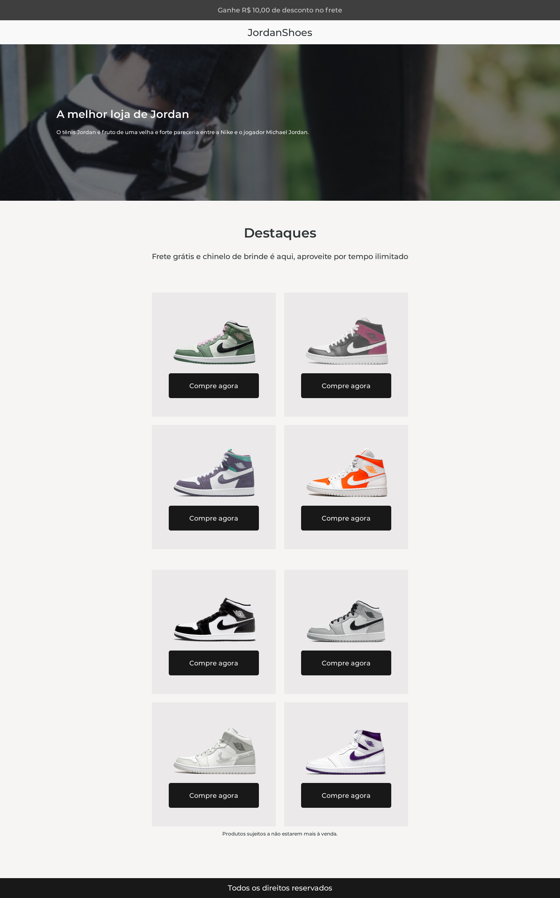

# JordanShoes 

      <a href="#-projeto">🖥 Projeto</a>&nbsp;&nbsp;&nbsp;|&nbsp;&nbsp;&nbsp;
      <a href="#-tecnologias">👨‍💻 Tecnologias</a>&nbsp;&nbsp;&nbsp;|&nbsp;&nbsp;&nbsp;
      <a href="#-executar-o-projeto">🖇 Execução do Projeto</a>&nbsp;&nbsp;&nbsp;|&nbsp;&nbsp;&nbsp;
      <a href="#-licença">📃 Licença</a>&nbsp;&nbsp;&nbsp;|&nbsp;&nbsp;&nbsp;
      <a href="#-licença">📌 Observações</a>&nbsp;&nbsp;&nbsp;|&nbsp;&nbsp;&nbsp;

  

  
  ## 🖥 Projeto
  Projeto desenvolvido para fins de prática e desenvolvimento dos conhecimentos de HTML e CSS.
  
Para ver o projeto no Figma, <a href="https://www.figma.com/file/OFPmaR4BYJd7QeChEOzHgL/Desafios---Codel%C3%A2ndia-(Copy)?node-id=1883%3A2">clique aqui</a>.

  ## 👨‍💻 Tecnologias
  As tecnologias usadas nesse projeto foram:
  - [HTML](https://developer.mozilla.org/en-US/docs/Web/HTML)
  - [CSS](https://developer.mozilla.org/en-US/docs/Web/CSS)

  ## 🖇 Executar o Projeto
  Para executar o projeto <a href="https://ednaldo-byte.github.io/JordanShoes/">clique aqui</a>

  ##  📃 Licença
  Esse projeto possui licença MIT. Para mais detalhes consulte o arquivo [LICENSE](LICENSE.md)

  ## 📌Observações
  O projeto está com responsividade, mas detalhes podem mudar dependendo do **navegador**. Por exemplo, na meu notebook, as colunas da página estavam agrupadas em 4 no navegador Chrome, já no Firefox, estavam agrupadas em 2.
 *
#dailyFrontend
*
